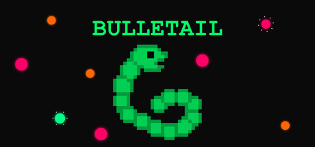
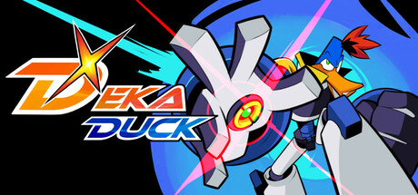

[](https://www.npmjs.com/package/steamworks-ffi-node)
[](https://discord.gg/Ruzx4Z7cKr)

# Steamworks FFI - Steamworks SDK Integration for Node.js applications

A TypeScript/JavaScript wrapper for the Steamworks SDK using Koffi FFI, designed for Node.js and Electron applications with **Steamworks SDK v1.63 integration**.

---

## 📑 Table of Contents

- [Features](#features)
- [Quick Start](#quick-start)
- [API Documentation](#api-documentation)
- [Steamworks Integration](#steamworks-integration)
- [Electron Integration](#electron-integration)
- [Requirements](#requirements)
- [Troubleshooting](#troubleshooting)
- [Projects Using This Library](#projects-using-this-library)
- [How to Support This Project](#how-to-support-this-project)
- [License](#license)

---

## Highlights

> ✅ **No C++ Compilation Required**: Uses Koffi FFI for seamless installation without Visual Studio Build Tools!

> ⚡ **Steamworks SDK v1.63**: Latest SDK with Linux ARM64, Android ARM64, and Lenovo Legion Go controller support!

> � **16 Complete API Managers**: 100% coverage of achievements, stats, leaderboards, friends, workshop, networking, and more - see [full documentation](https://github.com/ArtyProf/steamworks-ffi-node/blob/main/docs/README.md)!

> 🧪 **EXPERIMENTAL: Native Overlay for Electron** - Metal (macOS), OpenGL (Windows), OpenGL 3.3 (Linux/SteamOS). [See Documentation](https://github.com/ArtyProf/steamworks-ffi-node/blob/main/docs/STEAM_OVERLAY_INTEGRATION.md)

## Features

- **Core API**: Essential Steam application functions
  - ✅ Language detection (get current Steam language for localization)
  - ✅ Steam status monitoring
  - ✅ Callback processing
  - ✅ Ensure app launches through Steam
  - ✅ **Debug Mode** - Toggle detailed logging for troubleshooting **across all 16 managers**
  - ✅ **Centralized Logger** - `SteamLogger` utility for consistent logging across all modules
- **Complete Achievement API**: 100% coverage of Steam Achievement functionality (20/20 functions)
  - ✅ Core operations (get, unlock, clear, check status)
  - ✅ Visual features (icons, progress notifications)
  - ✅ Progress tracking (get limits for progress bars)
  - ✅ Friend comparisons (see friend achievements)
  - ✅ Global statistics (unlock percentages, popularity sorting)
  - ✅ Testing tools (reset stats/achievements)
- **Complete Stats API**: 100% coverage of Steam User Stats functionality (14/14 functions)
  - ✅ User stats (get/set int/float, average rate tracking)
  - ✅ Friend comparisons (compare stats with friends)
  - ✅ Global statistics (worldwide aggregated data with history)
- **Complete Leaderboard API**: 100% coverage of Steam Leaderboard functionality (7/7 functions)
  - ✅ Leaderboard management (find, create, get info)
  - ✅ Score operations (upload with optional details)
  - ✅ Entry download (global, friends, specific users)
  - ✅ UGC integration (attach replays/screenshots to entries)
- **Friends & Social API**: Complete Steam friends and social features (22 functions)
  - ✅ Current user info (persona name, online state)
  - ✅ Friends list management (count, iterate, get all friends)
  - ✅ Friend information (names, states, relationships, Steam levels)
  - ✅ Friend activity (check games being played)
  - ✅ Friend avatars (small/medium/large avatar handles)
  - ✅ Friend groups (tags/categories management)
  - ✅ Coplay tracking (recently played with users)
- **Rich Presence API**: Complete Rich Presence support (6 functions)
  - ✅ Set/clear rich presence key/value pairs
  - ✅ Query friend rich presence data
  - ✅ Display custom status in friends list
  - ✅ Enable friend join functionality
- **Overlay API**: Complete Steam overlay control (7 functions)
  - ✅ Open overlay dialogs (friends, achievements, settings, etc.)
  - ✅ Open user profiles, stats, and achievements
  - ✅ Open overlay web browser to URLs
  - ✅ Open store pages with purchase options
  - ✅ Show invite dialogs for multiplayer sessions
- **Cloud Storage API**: Complete Steam Cloud (Remote Storage) integration (17 functions)
  - ✅ File operations (write, read, delete, check existence)
  - ✅ File metadata (size, timestamp, persistence status)
  - ✅ File listing (count, iterate, get all with details)
  - ✅ Quota management (track storage usage and limits)
  - ✅ Cloud settings (check/toggle cloud sync for account and app)
  - ✅ Batch writes (atomic multi-file operations)
- **Workshop API**: Complete Steam Workshop/UGC integration (33 functions)
  - ✅ Subscription management (subscribe, unsubscribe, list items)
  - ✅ Item state & information (download progress, installation info)
  - ✅ Query operations (text search, browse, filter Workshop content)
  - ✅ Item creation & update (create, upload, manage your Workshop items)
  - ✅ Voting & favorites (vote on items, manage favorites)
  - ✅ Item deletion (permanently delete your Workshop items)
- **Input API**: Complete Steam Input (controller) support (35+ functions) ⚠️ _Tested with virtual gamepad only_
  - ✅ Controller detection (Xbox, PlayStation, Switch, Steam Controller, Steam Deck)
  - ✅ Action sets and layers (menu controls, gameplay controls, etc.)
  - ✅ Digital actions (buttons) and analog actions (sticks/triggers)
  - ✅ Motion data (gyro, accelerometer for supported controllers)
  - ✅ Haptics (vibration, LED control for DualShock/DualSense)
- **Screenshots API**: Steam Screenshots integration (9 functions)
  - ✅ Screenshot capture (programmatic and user-triggered)
  - ✅ Add existing images to Steam library
  - ✅ Location and user tagging (geotag, tag friends)
  - ✅ Workshop integration (tag published files)
  - ✅ Screenshot hooks (intercept F12 screenshots)
  - ✅ VR screenshot support
- **Apps/DLC API**: Complete DLC and app ownership (28 functions)
  - ✅ DLC ownership and installation checks
  - ✅ Install/uninstall optional DLC
  - ✅ App ownership verification (free weekend, Family Sharing)
  - ✅ Beta branch management
  - ✅ App metadata (languages, build info, install paths)
  - ✅ Launch parameters and timed trials
- **Matchmaking API**: Complete multiplayer lobby matchmaking (30+ functions) ⚠️ _Requires two Steam accounts for testing_
  - ✅ Lobby creation (public, private, friends-only, invisible)
  - ✅ Lobby searching with filters (string, numerical, distance)
  - ✅ Lobby joining and leaving
  - ✅ Lobby data (get/set metadata for searching and game state)
  - ✅ Member management (list, limit, ownership transfer)
  - ✅ Lobby chat (send/receive messages)
  - ✅ Game server association
- **Utils API**: Complete Steam utilities and system information (29 functions)
  - ✅ System information (battery level, IP country, server time)
  - ✅ Steam Deck and Big Picture mode detection
  - ✅ Overlay notification positioning
  - ✅ Image loading from Steam cache (avatars, achievement icons)
  - ✅ Gamepad text input dialogs
  - ✅ Text filtering for user-generated content
- **Networking Utils API**: Complete Steam networking utilities (15 functions)
  - ✅ Relay network initialization and monitoring
  - ✅ Ping location for matchmaking (share with other players)
  - ✅ Ping estimation between players (without sending packets)
  - ✅ Data center (POP) information and ping times
- **Networking Sockets API**: Complete P2P networking (34 functions) ⚠️ _Requires two Steam accounts for testing_
  - ✅ P2P connections (connect to players via Steam ID)
  - ✅ Listen sockets (accept incoming connections)
  - ✅ Reliable and unreliable messaging
  - ✅ Poll groups (efficiently handle multiple connections)
  - ✅ Connection status (state, ping, quality metrics)
  - ✅ High-precision local timestamps
- **User API**: Complete user authentication and info (28 functions)
  - ✅ Session tickets (P2P/game server authentication)
  - ✅ Web API tickets (backend authentication)
  - ✅ Auth session validation (server-side ticket verification)
  - ✅ Encrypted app tickets (secure backend verification)
  - ✅ License verification (check DLC/app ownership for authenticated users)
  - ✅ User security info (2FA, phone verification status)
  - ✅ Duration control (playtime limits for China compliance)
  - ✅ Voice recording (compress, decompress, transmit voice chat)
  - ✅ User info (Steam level, badge levels, data folder)
- **Steamworks Integration**: Direct FFI calls to Steamworks C++ SDK
- **Cross-Platform**: Windows, macOS, and Linux support
- **Easy Setup**: Simple installation with clear SDK setup guide
  - 🎉 **No steam_appid.txt file required** - Uses environment variables automatically
  - 🎉 **Custom SDK paths** - Organize SDK in vendor/, monorepo/, or any folder structure
  - Just pass your App ID to `init()` and you're ready!
- **Electron Ready**: Perfect for Electron applications
- **TypeScript Support**: Complete TypeScript definitions included
- **No C++ Compilation**: Uses Koffi FFI for seamless installation

## Quick Start

### Installation

```bash
# Install the package
npm install steamworks-ffi-node
```

### Setup

1. **Download Steamworks SDK** (required separately due to licensing):

   - Visit [Steamworks Partner site](https://partner.steamgames.com/)
   - Download the latest Steamworks SDK
   - Extract and copy `redistributable_bin` folder to your project
   - See [STEAMWORKS_SDK_SETUP.md](https://github.com/ArtyProf/steamworks-ffi-node/blob/main/docs/STEAMWORKS_SDK_SETUP.md) for detailed instructions
   - Default location: `steamworks_sdk/` in project root
   - Can now use custom locations! See `setSdkPath()` method below

2. **Set your Steam App ID** - No file creation needed!

   The library automatically sets the `SteamAppId` environment variable when you call `init()`.
   
   **For Development (Default SDK Location):**
   ```typescript
   const steam = SteamworksSDK.getInstance();
   
   // SDK at: your-project/steamworks_sdk/
   if (steam.restartAppIfNecessary(480)) {
     process.exit(0);
   }
   
   steam.init({ appId: 480 });
   ```
   
   **For Custom SDK Location:**
   ```typescript
   const steam = SteamworksSDK.getInstance();
   
   // IMPORTANT: Set SDK path BEFORE restartAppIfNecessary() or init()
   steam.setSdkPath('vendor/steamworks_sdk');  // SDK in vendor folder
   
   if (steam.restartAppIfNecessary(480)) {
     process.exit(0);
   }
   
   steam.init({ appId: 480 });
   ```
   
   **Custom SDK Path Examples:**
   ```typescript
   // SDK in vendor folder: your-project/vendor/steamworks_sdk/
   steam.setSdkPath('vendor/steamworks_sdk');
   
   // SDK in nested structure: your-project/source/main/sdk/steamworks/
   steam.setSdkPath('source/main/sdk/steamworks');
   
   // SDK in monorepo: monorepo/packages/game/steamworks_sdk/
   steam.setSdkPath('packages/game/steamworks_sdk');
   ```
   
   **Debug Mode (Optional):**
   ```typescript
   const steam = SteamworksSDK.getInstance();
   
   // Enable debug logs to see initialization details
   steam.setDebug(true);
   
   // Set custom SDK path if needed (debug logs will show path resolution)
   steam.setSdkPath('vendor/steamworks_sdk');
   
   // Check restart requirement (debug logs will show library loading)
   if (steam.restartAppIfNecessary(480)) {
     process.exit(0);
   }
   
   // Initialize (debug logs will show initialization steps)
   steam.init({ appId: 480 });
   
   // Disable debug logs after initialization
   steam.setDebug(false);
   ```
   
   > **Note:** Debug mode is useful for troubleshooting SDK path issues and initialization problems.
   > Errors and warnings always display regardless of debug mode setting.

   **Optional: Create `steam_appid.txt` manually** (if needed for other tools):
   ```bash
   echo "480" > steam_appid.txt  # Use 480 for testing, or your Steam App ID
   ```
   
   **For Production:**
   ```typescript
   // Check if launched through Steam, restart if necessary
   if (steam.restartAppIfNecessary(480)) {
     process.exit(0); // Steam will relaunch your app
   }
   
   steam.init({ appId: 480 });
   ```

3. **Make sure Steam is running** and you're logged in

### Basic Usage

```typescript
import SteamworksSDK, {
  LeaderboardSortMethod,
  LeaderboardDisplayType,
  LeaderboardUploadScoreMethod,
  LeaderboardDataRequest,
  EFriendFlags,
  EUGCQuery,
  EUGCMatchingUGCType,
  EItemState,
} from "steamworks-ffi-node";

// Helper to auto-start callback polling
function startCallbackPolling(steam: SteamworksSDK, interval: number = 1000) {
  return setInterval(() => {
    steam.runCallbacks();
  }, interval);
}

// Initialize Steam connection
const steam = SteamworksSDK.getInstance();
const initialized = steam.init({ appId: 480 }); // Your Steam App ID

if (initialized) {
  // Start callback polling automatically (required for async operations)
  const callbackInterval = startCallbackPolling(steam, 1000);

  // Get current Steam language for localization
  const language = steam.getCurrentGameLanguage();
  console.log("Steam language:", language); // e.g., 'english', 'french', 'german'

  // Get achievements from Steam servers
  const achievements = await steam.achievements.getAllAchievements();
  console.log("Steam achievements:", achievements);

  // Unlock achievement (permanent in Steam!)
  await steam.achievements.unlockAchievement("ACH_WIN_ONE_GAME");

  // Check unlock status from Steam
  const isUnlocked = await steam.achievements.isAchievementUnlocked(
    "ACH_WIN_ONE_GAME"
  );
  console.log("Achievement unlocked:", isUnlocked);

  // Track user statistics
  const kills = (await steam.stats.getStatInt("total_kills")) || 0;
  await steam.stats.setStatInt("total_kills", kills + 1);

  // Get global statistics
  await steam.stats.requestGlobalStats(7);
  await new Promise((resolve) => setTimeout(resolve, 2000));
  steam.runCallbacks();
  const globalKills = await steam.stats.getGlobalStatInt("global.total_kills");
  console.log("Total kills worldwide:", globalKills);

  // Work with leaderboards
  const leaderboard = await steam.leaderboards.findOrCreateLeaderboard(
    "HighScores",
    LeaderboardSortMethod.Descending,
    LeaderboardDisplayType.Numeric
  );

  if (leaderboard) {
    // Upload score
    await steam.leaderboards.uploadLeaderboardScore(
      leaderboard.handle,
      1000,
      LeaderboardUploadScoreMethod.KeepBest
    );

    // Download top 10 scores
    const topScores = await steam.leaderboards.downloadLeaderboardEntries(
      leaderboard.handle,
      LeaderboardDataRequest.Global,
      1,
      10
    );
    console.log("Top 10 scores:", topScores);
  }

  // Access friends and social features
  const personaName = steam.friends.getPersonaName();
  const friendCount = steam.friends.getFriendCount(EFriendFlags.All);
  console.log(`${personaName} has ${friendCount} friends`);

  // Get all friends with details
  const allFriends = steam.friends.getAllFriends(EFriendFlags.All);
  allFriends.slice(0, 5).forEach((friend) => {
    const name = steam.friends.getFriendPersonaName(friend.steamId);
    const state = steam.friends.getFriendPersonaState(friend.steamId);
    const level = steam.friends.getFriendSteamLevel(friend.steamId);
    console.log(`${name}: Level ${level}, Status: ${state}`);

    // Get avatar handles
    const smallAvatar = steam.friends.getSmallFriendAvatar(friend.steamId);
    const mediumAvatar = steam.friends.getMediumFriendAvatar(friend.steamId);
    if (smallAvatar > 0) {
      console.log(
        `  Avatar handles: small=${smallAvatar}, medium=${mediumAvatar}`
      );
    }

    // Check if playing a game
    const gameInfo = steam.friends.getFriendGamePlayed(friend.steamId);
    if (gameInfo) {
      console.log(`  Playing: App ${gameInfo.gameId}`);
    }
  });

  // Check friend groups (tags)
  const groupCount = steam.friends.getFriendsGroupCount();
  if (groupCount > 0) {
    const groupId = steam.friends.getFriendsGroupIDByIndex(0);
    const groupName = steam.friends.getFriendsGroupName(groupId);
    const members = steam.friends.getFriendsGroupMembersList(groupId);
    console.log(`Group "${groupName}" has ${members.length} members`);
  }

  // Check recently played with
  const coplayCount = steam.friends.getCoplayFriendCount();
  if (coplayCount > 0) {
    const recentPlayer = steam.friends.getCoplayFriend(0);
    const playerName = steam.friends.getFriendPersonaName(recentPlayer);
    const coplayTime = steam.friends.getFriendCoplayTime(recentPlayer);
    console.log(`Recently played with ${playerName}`);
  }

  // Set rich presence for custom status
  steam.richPresence.setRichPresence("status", "In Main Menu");
  steam.richPresence.setRichPresence("connect", "+connect server:27015");

  // Open Steam overlay
  steam.overlay.activateGameOverlay("Friends"); // Open friends list
  steam.overlay.activateGameOverlayToWebPage("https://example.com/wiki"); // Open wiki

  // Steam Cloud storage operations
  const saveData = { level: 5, score: 1000, inventory: ["sword", "shield"] };
  const buffer = Buffer.from(JSON.stringify(saveData));

  // Write save file to Steam Cloud
  const written = steam.cloud.fileWrite("savegame.json", buffer);
  if (written) {
    console.log("✅ Save uploaded to Steam Cloud");
  }

  // Check cloud quota
  const quota = steam.cloud.getQuota();
  console.log(
    `Cloud storage: ${quota.usedBytes}/${
      quota.totalBytes
    } bytes (${quota.percentUsed.toFixed(2)}%)`
  );

  // Read save file from Steam Cloud
  if (steam.cloud.fileExists("savegame.json")) {
    const result = steam.cloud.fileRead("savegame.json");
    if (result.success && result.data) {
      const loadedSave = JSON.parse(result.data.toString());
      console.log(
        `Loaded save: Level ${loadedSave.level}, Score ${loadedSave.score}`
      );
    }
  }

  // List all cloud files
  const cloudFiles = steam.cloud.getAllFiles();
  console.log(`Steam Cloud contains ${cloudFiles.length} files:`);
  cloudFiles.forEach((file) => {
    const kb = (file.size / 1024).toFixed(2);
    const status = file.persisted ? "☁️" : "⏳";
    console.log(`${status} ${file.name} - ${kb} KB`);
  });

  // Steam Workshop operations
  // Subscribe to a Workshop item
  const subscribeResult = await steam.workshop.subscribeItem(123456789n);
  if (subscribeResult.success) {
    console.log("✅ Subscribed to Workshop item");
  }

  // Get all subscribed items
  const subscribedItems = steam.workshop.getSubscribedItems();
  console.log(`Subscribed to ${subscribedItems.length} Workshop items`);

  // Query Workshop items with text search
  const query = steam.workshop.createQueryAllUGCRequest(
    EUGCQuery.RankedByTextSearch,
    EUGCMatchingUGCType.Items,
    480, // Creator App ID
    480, // Consumer App ID
    1 // Page 1
  );

  if (query) {
    // Set search text to filter results
    steam.workshop.setSearchText(query, "map");

    const queryResult = await steam.workshop.sendQueryUGCRequest(query);
    if (queryResult) {
      console.log(
        `Found ${queryResult.numResults} Workshop items matching "map"`
      );

      // Get details for each item
      for (let i = 0; i < queryResult.numResults; i++) {
        const details = steam.workshop.getQueryUGCResult(query, i);
        if (details) {
          console.log(`📦 ${details.title} by ${details.steamIDOwner}`);
          console.log(
            `   Score: ${details.score}, Downloads: ${details.numUniqueSubscriptions}`
          );
        }
      }
    }
    steam.workshop.releaseQueryUGCRequest(query);
  }

  // Check download progress for subscribed items
  subscribedItems.forEach((itemId) => {
    const state = steam.workshop.getItemState(itemId);
    const stateFlags = [];
    if (state & EItemState.Subscribed) stateFlags.push("Subscribed");
    if (state & EItemState.NeedsUpdate) stateFlags.push("Needs Update");
    if (state & EItemState.Installed) stateFlags.push("Installed");
    if (state & EItemState.Downloading) stateFlags.push("Downloading");

    console.log(`Item ${itemId}: ${stateFlags.join(", ")}`);

    if (state & EItemState.Downloading) {
      // If downloading
      const progress = steam.workshop.getItemDownloadInfo(itemId);
      if (progress) {
        const percent = ((progress.downloaded / progress.total) * 100).toFixed(
          1
        );
        console.log(
          `  Download: ${percent}% (${progress.downloaded}/${progress.total} bytes)`
        );
      }
    }

    if (state & EItemState.Installed) {
      // If installed
      const info = steam.workshop.getItemInstallInfo(itemId);
      if (info.success) {
        console.log(`  Installed at: ${info.folder}`);
      }
    }
  });
}

// Cleanup
clearInterval(callbackInterval);
steam.shutdown();
```

### JavaScript

```javascript
// Option 1: ESM Named import
import { SteamworksSDK } from "steamworks-ffi-node";

// Option 2: CommonJs named import (recommended - no .default needed)
const { SteamworksSDK } = require("steamworks-ffi-node");

// Option 3: CommonJs default named import (also works)
const SteamworksSDK = require("steamworks-ffi-node").default;

// Helper to auto-start callback polling
function startCallbackPolling(steam, interval = 1000) {
  return setInterval(() => {
    steam.runCallbacks();
  }, interval);
}

async function example() {
  const steam = SteamworksSDK.getInstance();

  if (steam.init({ appId: 480 })) {
    // Start callback polling automatically
    const callbackInterval = startCallbackPolling(steam, 1000);

    const achievements = await steam.achievements.getAllAchievements();
    console.log(`Found ${achievements.length} achievements`);

    // Unlock first locked achievement
    const locked = achievements.find((a) => !a.unlocked);
    if (locked) {
      await steam.achievements.unlockAchievement(locked.apiName);
    }

    // Cleanup
    clearInterval(callbackInterval);
  }

  steam.shutdown();
}

example();
```

### Testing with Spacewar

For immediate testing, use Spacewar (App ID 480):

- Free Steam app for testing Steamworks features
- Add to Steam library: `steam://install/480` or search "Spacewar" in Steam
- Launch it once, then you can test with App ID 480

## API Documentation

Complete documentation for all APIs is available in the [docs folder](https://github.com/ArtyProf/steamworks-ffi-node/tree/main/docs):

➡️ **[View Complete Documentation](https://github.com/ArtyProf/steamworks-ffi-node/blob/main/docs/README.md)**

### API Guides:

- **[Steam API Core](https://github.com/ArtyProf/steamworks-ffi-node/blob/main/docs/STEAM_API_CORE.md)** - Core initialization, shutdown, and lifecycle management
- **[Achievement Manager](https://github.com/ArtyProf/steamworks-ffi-node/blob/main/docs/ACHIEVEMENT_MANAGER.md)** - Complete achievement system (20 functions)
- **[Stats Manager](https://github.com/ArtyProf/steamworks-ffi-node/blob/main/docs/STATS_MANAGER.md)** - User and global statistics (14 functions)
- **[Leaderboard Manager](https://github.com/ArtyProf/steamworks-ffi-node/blob/main/docs/LEADERBOARD_MANAGER.md)** - Leaderboard operations (7 functions)
- **[Friends Manager](https://github.com/ArtyProf/steamworks-ffi-node/blob/main/docs/FRIENDS_MANAGER.md)** - Friends and social features (22 functions)
- **[Rich Presence Manager](https://github.com/ArtyProf/steamworks-ffi-node/blob/main/docs/RICH_PRESENCE_MANAGER.md)** - Custom status display and join functionality (6 functions)
- **[Overlay Manager](https://github.com/ArtyProf/steamworks-ffi-node/blob/main/docs/OVERLAY_MANAGER.md)** - Steam overlay control (7 functions)
- **[Cloud Storage Manager](https://github.com/ArtyProf/steamworks-ffi-node/blob/main/docs/CLOUD_MANAGER.md)** - Steam Cloud file operations (14 functions)
- **[Workshop Manager](https://github.com/ArtyProf/steamworks-ffi-node/blob/main/docs/WORKSHOP_MANAGER.md)** - Steam Workshop/UGC operations (33 functions)
- **[Input Manager](https://github.com/ArtyProf/steamworks-ffi-node/blob/main/docs/INPUT_MANAGER.md)** - Steam Input controller support (35+ functions) ⚠️ _Virtual gamepad testing only_
- **[Apps Manager](https://github.com/ArtyProf/steamworks-ffi-node/blob/main/docs/APPS_MANAGER.md)** - DLC and app ownership (28 functions)
- **[Screenshot Manager](https://github.com/ArtyProf/steamworks-ffi-node/blob/main/docs/SCREENSHOT_MANAGER.md)** - Steam Screenshots integration (9 functions)
- **[Matchmaking Manager](https://github.com/ArtyProf/steamworks-ffi-node/blob/main/docs/MATCHMAKING_MANAGER.md)** - Multiplayer lobby matchmaking (30+ functions) ⚠️ _Requires two Steam accounts_
- **[Utils Manager](https://github.com/ArtyProf/steamworks-ffi-node/blob/main/docs/UTILS_MANAGER.md)** - System info, Steam Deck detection, image loading (29 functions)
- **[Networking Utils Manager](https://github.com/ArtyProf/steamworks-ffi-node/blob/main/docs/NETWORKING_UTILS_MANAGER.md)** - Ping location, relay network, data centers (15 functions)
- **[Networking Sockets Manager](https://github.com/ArtyProf/steamworks-ffi-node/blob/main/docs/NETWORKING_SOCKETS_MANAGER.md)** - P2P connections, reliable messaging (34 functions) ⚠️ _Requires two Steam accounts_
- **[User Manager](https://github.com/ArtyProf/steamworks-ffi-node/blob/main/docs/USER_MANAGER.md)** - User authentication, security, voice chat (28 functions)
- **[Steam Overlay Integration](https://github.com/ArtyProf/steamworks-ffi-node/blob/main/docs/STEAM_OVERLAY_INTEGRATION.md)** - Native overlay for Electron apps (macOS/Windows/Linux) 🧪 _Experimental_

## Steamworks Integration

This library connects directly to the Steam client and Steamworks SDK:

```javascript
// Steamworks API
const steam = SteamworksSDK.getInstance();
steam.init({ appId: 480 }); // Connects to actual Steam

// Live achievements from Steam servers
const achievements = await steam.achievements.getAllAchievements();
console.log(achievements); // Achievement data from your Steam app

// Permanent achievement unlock in Steam
await steam.achievements.unlockAchievement("YOUR_ACHIEVEMENT");
// ^ This shows up in Steam overlay and is saved permanently
```

**What happens when you unlock an achievement:**

- ✅ Steam overlay notification appears
- ✅ Achievement saved to Steam servers permanently
- ✅ Syncs across all devices
- ✅ Appears in Steam profile
- ✅ Counts toward Steam statistics

## Electron Integration

For Electron applications, use it in your main process:

```typescript
// main.ts
import { app } from "electron";
import SteamworksSDK from "steamworks-ffi-node";

app.whenReady().then(() => {
  const steam = SteamworksSDK.getInstance();

  if (steam.init({ appId: YOUR_STEAM_APP_ID })) {
    console.log("Steam initialized in Electron!");

    // Handle achievement unlocks from renderer process
    // via IPC if needed
  }
});

app.on("before-quit", () => {
  const steam = SteamworksSDK.getInstance();
  steam.shutdown();
});
```

### 📦 Electron Packaging

For Electron applications, the library will automatically detect the Steamworks SDK files in your project directory. No special packaging configuration is needed - just ensure your `steamworks_sdk/redistributable_bin` folder is present in your project.

The library searches for the SDK in standard locations within your Electron app bundle.

## Requirements

- **Node.js**: 18+
- **Steam Client**: Must be running and logged in
- **Steam App ID**: Get yours at [Steamworks Partner](https://partner.steamgames.com/) and pass to `steam.init({ appId: YOUR_APP_ID })`
- No file creation required - library uses environment variables automatically
- Optional: You can manually create `steam_appid.txt` if needed for other Steam tools

### Platform Support

- ✅ **Windows**: steam_api64.dll / steam_api.dll
- ✅ **macOS**: libsteam_api.dylib
- ✅ **Linux x64**: libsteam_api.so
- ✅ **Linux x86**: libsteam_api.so
- ✅ **Linux ARM64**: libsteam_api.so (SDK 1.63+)
- ✅ **Android ARM64**: libsteam_api.so (SDK 1.63+)

**Steamworks SDK Version**: v1.63 (Latest)

_Note: You must download and install the SDK redistributables separately as described in the Setup section above._

## Troubleshooting

### "SteamAPI_Init failed"

- ❌ Steam client not running → **Solution**: Start Steam and log in
- ❌ No App ID specified → **Solution**: Pass App ID to `steam.init({ appId: 480 })` (library sets environment variable automatically)
- ❌ Invalid App ID → **Solution**: Use 480 for testing, or your registered App ID from Steamworks Partner
- ℹ️ **Note**: The library automatically handles App ID via environment variables - no file creation needed!

### "Cannot find module 'steamworks-ffi-node'"

- ❌ Package not installed → **Solution**: Run `npm install steamworks-ffi-node`

### Achievement operations not working

- ❌ Not initialized → **Solution**: Call `steam.init({ appId })` first
- ❌ No achievements configured → **Solution**: Configure achievements in Steamworks Partner site
- ❌ Using Spacewar → **Note**: Spacewar may not have achievements, use your own App ID

### Electron-specific issues

- ❌ Initialized in renderer → **Solution**: Only initialize in main process
- ❌ Not cleaning up → **Solution**: Call `shutdown()` in `before-quit` event
- ❌ "Steamworks SDK library not found" in packaged app → **Solution**: Include SDK redistributables in your build (see Electron Packaging section above)
- ❌ Native module errors in packaged app → **Solution**: Ensure Steamworks SDK files are properly included in your app bundle

---

## Projects Using This Library

Here are some projects and applications built with `steamworks-ffi-node`:

### Bulletail
**[Steam Store Page](https://store.steampowered.com/app/4087020/)**

<p align="center">
  <a href="https://store.steampowered.com/app/4087020/">
    
  </a>
</p>

Snake-meets-bullet-hell roguelike where your tail is your ammo. Eat bullets to grow, spend length to shoot, and survive escalating waves, enemies, and bosses.

---

### DekaDuck
**[Steam Store Page](https://store.steampowered.com/app/3715040/)**

<p align="center">
  <a href="https://store.steampowered.com/app/3715040/">
    
  </a>
</p>

DekaDuck is a 2D action platformer, featuring fully hand-drawn art and animation. Fight enemies using their own abilities and quirks to solve puzzles and defeat bosses, in a sci-fi world full of conspiracies!

---

### Falling Face Fragments
**[Steam Store Page](https://store.steampowered.com/app/3905510/Falling_Face_Fragments/)**

<p align="center">
  <a href="https://store.steampowered.com/app/3905510/">
    
  </a>
</p>

Falling Face Fragments is a falling block puzzle game where you must assemble faces correctly and clear them on a button press. The more faces you have on screen when you choose to clear them, the higher you will score! Three fun modes of play; arcade mode, mission mode, and local 2-player! 

---

### Add Your Project

Using `steamworks-ffi-node` in your project? We'd love to showcase it here!

**To add your project:**
1. Create an issue
2. Add there your project details to share in this section:
   - Project name and brief description
   - Links (Steam page, GitHub, website)

Your project helps demonstrate the library's capabilities and inspires other developers!

---

## How to Support This Project

You can support the development of this library by wishlisting, subscribing, and purchasing the app **AFK Companion** on Steam:

<p align="center">
  <a href="https://store.steampowered.com/app/2609100/AFK_Companion/">
    
  </a>
</p>

👉 [AFK Companion on Steam](https://store.steampowered.com/app/2609100/AFK_Companion/)

- Add the app to your wishlist
- Subscribe to updates
- Buy and run the app

**AFK Companion** is built using this library! Your support helps fund further development and improvements.

---

## License

MIT License - see LICENSE file for details.

**Note**: This package requires the Steamworks SDK redistributables to be installed separately by users. Users are responsible for complying with Valve's Steamworks SDK Access Agreement when downloading and using the SDK.
